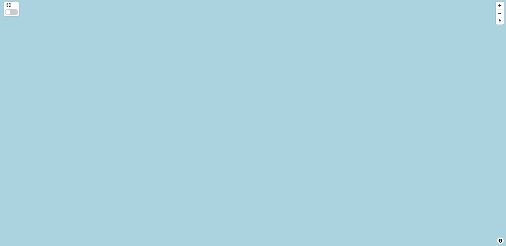

# `pg_rtiles_demo`

This is a demo project and PoC for [pg_rtiles](https://github.com/gportenko/pg_rtiles)

Project consists of: 
- keycloak
- nginx with implemented authorization via lua scripts
- PostgreSQL with installed `postgis` and `rtiles` extensions
- `tileserver` - web server for handling vector tile requests

---



## Features

- Dynamic vector tiles delivery with a thin HTTP layer and custom PostgreSQL extension written in `rust`
- Role based access control of map layers data
- Real-time spatial clustering of point objects at database level

## Running the project

The project can be run via docker compose:
```
docker compose up 
```
Frontend will be available at `https://localhost`

The following credentials with different access rights can be used:

- `dispatcher` / `dispatcher`
- `guest` / `guest`

Keycloak will be running at `http://localhost:7081` with admin credentials `admin` / `admin`

## TODO
- Tiles caching with nginx